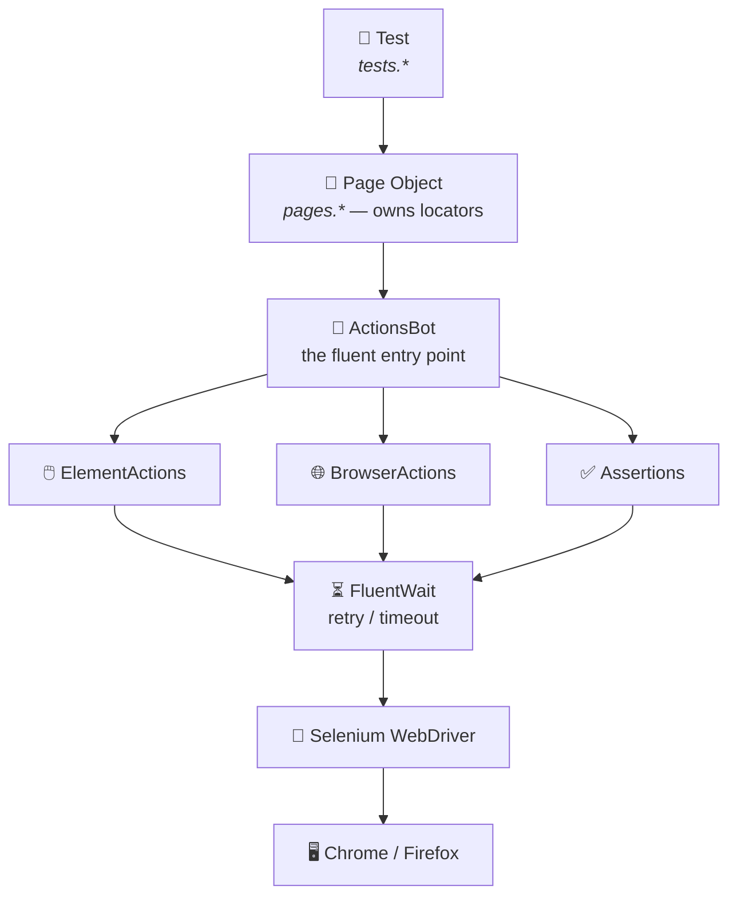
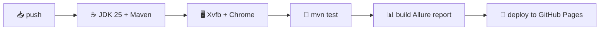

# 🤖 testAutomation — a fluent Selenium engine

> A hand-built, SHAFT-style UI test automation framework in Java: one fluent **`bot`** drives the browser, the pages stay clean, and every run publishes a rich report — automatically, in the cloud.

[](https://github.com/MEltayar/testAutomation/actions/workflows/tests.yml)


### 📊 **[▶ View the live test report](https://meltayar.github.io/testAutomation/)**
Published automatically to GitHub Pages after every push.

---

## ✨ Features

| | Feature | What it gives you |
|---|---|---|
| 🔗 | **Fluent engine** | Read tests like English: `bot.element().type(user, "x").click(go)` |
| 🧩 | **Grouped API** | `element()` · `browser()` · `assertThat()` — pick a category, get only its methods |
| ⏳ | **Self-healing waits** | Every action retries via `FluentWait` until it works or times out — no flaky tests |
| 🏭 | **Driver factory** | Switch Chrome ⇄ Firefox from **one line of config**, not code |
| ⚙️ | **External config** | Browser, timeout, and per-app URLs live in `config.properties` |
| 📄 | **Page Object Model** | Locators sealed inside pages; tests speak in business steps |
| 📝 | **Logging** | Clean SLF4J/Logback console output for every step |
| 📸 | **Screenshot on failure** | Captured **at the exact failing step** and attached to the report |
| 🔄 | **CI/CD** | GitHub Actions runs the suite on every push and publishes the report online |

---

## 🏗️ Architecture

Three clean layers — the test never touches Selenium directly.



| Layer | Package | Job |
|---|---|---|
| 🧪 **Tests** | `tests.*` | *Which* scenarios to run |
| 📄 **Pages** | `pages.*` | *What* a page can do (locators + flows) |
| 🤖 **Engine** | `engine.*` | *How* to drive the browser (reusable, app-agnostic) |

---

## 📁 Project structure

```
src/main/java/
├── engine/                      🤖 the reusable framework
│   ├── ActionsBot.java          ⤷ fluent entry point (facade)
│   ├── element/                 🖱️ type · click · submit · clear · hover · doubleClick · selectByText
│   ├── browser/                 🌐 navigateTo · refresh · back · forward · quitBrowser
│   ├── assertion/               ✅ dispatcher → element(locator) / browser()
│   ├── config/                  ⚙️ reads config.properties
│   ├── driver/                  🏭 builds Chrome / Firefox
│   └── report/                  📝 logging + Allure step + screenshot
└── pages/                       📄 page objects (app-specific)
    ├── duckduckgo/ · saucedemo/ · heroku/

src/test/java/
├── tests/                       🧪 the actual @Test classes
│   ├── duckduckgo/ · saucedemo/ · heroku/
├── templates/                   🧱 TestCase / TestScenario base classes
└── listeners/                   🎧 ReportServer (clean-before / serve-after)
```

---

## 🤖 The fluent engine

One object — **`bot`** — hands out three specialists:

```java
bot.element()      // 🖱️ actions on elements
bot.browser()      // 🌐 actions on the browser
bot.assertThat()   // ✅ assertions (by target)
```

### 🖱️ Element actions
```java
bot.element()
   .type(usernameInput, "standard_user")
   .type(passwordInput, "secret_sauce")
   .click(loginButton);
```
`type` · `click` · `submit` · `clear` · `doubleClick` · `hover` · `selectByText`

### 🌐 Browser actions
```java
bot.browser().navigateTo("https://www.saucedemo.com");
bot.browser().refresh();
```
`navigateTo` · `refresh` · `back` · `forward` · `quitBrowser`

### ✅ Assertions — pick a target, then the check
```java
bot.assertThat().browser().titleIs("Google");
bot.assertThat().browser().urlContains("/inventory");
bot.assertThat().element(logo).isDisplayed();
bot.assertThat().element(cartBadge).textIs("1");
```
**Browser:** `urlIs` · `urlContains` · `titleIs` · `titleContains`
**Element:** `isDisplayed` · `isSelected` · `isEnabled` · `textIs` · `textContains` · `attributeIs` · `linkHrefIs` · `linkHrefContains`

---

## 📄 Page Object → 🧪 Test

Locators live in the **page**; the test reads as plain steps:

```java
// 📄 pages/saucedemo/Login.java  — the page owns the locators
public Inventory login(String user, String pass) {
    bot.element()
       .type(usernameInput, user)
       .type(passwordInput, pass)
       .click(loginButton);
    return new Inventory(bot);
}
```

```java
// 🧪 tests/saucedemo/SauceDemoTests.java  — the test speaks in business steps
@Test
public void successfulLoginTest() {
    new Login(bot)
        .navigateTo()
        .login("standard_user", "secret_sauce")
        .assertInventoryPageURL();
}
```

---

## ⚙️ Configuration

Everything tunable lives in **`src/main/resources/config.properties`** — change it, no recompiling:

| Key | Example | Meaning |
|---|---|---|
| `browser` | `chrome` \| `firefox` | Which browser to launch |
| `timeout` | `5` | Seconds before an action gives up |
| `pollingMillis` | `250` | How often it re-checks while waiting |
| `autoServeReport` | `true` | Auto-open the report locally after a run (Windows) |
| `sauceDemoBaseURL` | `https://www.saucedemo.com` | Per-app base URL |

---

## ▶️ Running locally

```bash
# run the whole suite
mvn test

# run one test class
mvn test -Dtest=SauceDemoTests

# switch browser without touching code
#   → set  browser=firefox  in config.properties

# open the report in your browser
mvn allure:serve
```

---

## 📊 Reporting

Powered by **Allure**. Every action becomes a named step; on a failure, a **screenshot is captured at the exact failing step** and attached.

```
run starts → old results wiped
each action → logged + recorded as a step
on failure  → 📸 screenshot pinned to that step
run ends    → report published (locally or to GitHub Pages)
```

---

## 🔄 CI/CD — GitHub Actions

On every **push** (or manual trigger), `.github/workflows/tests.yml`:



Result: a fresh, **[live report](https://meltayar.github.io/testAutomation/)** after every push — no laptop required.

---

## 🛠️ Tech stack

**Java 25** · **Selenium 4** · **TestNG** · **Allure** · **SLF4J + Logback** · **Maven** · **GitHub Actions**

---

<sub>Built iteratively as a learning project — from a single god-class to a layered, reported, CI-backed framework. 🚀</sub>
