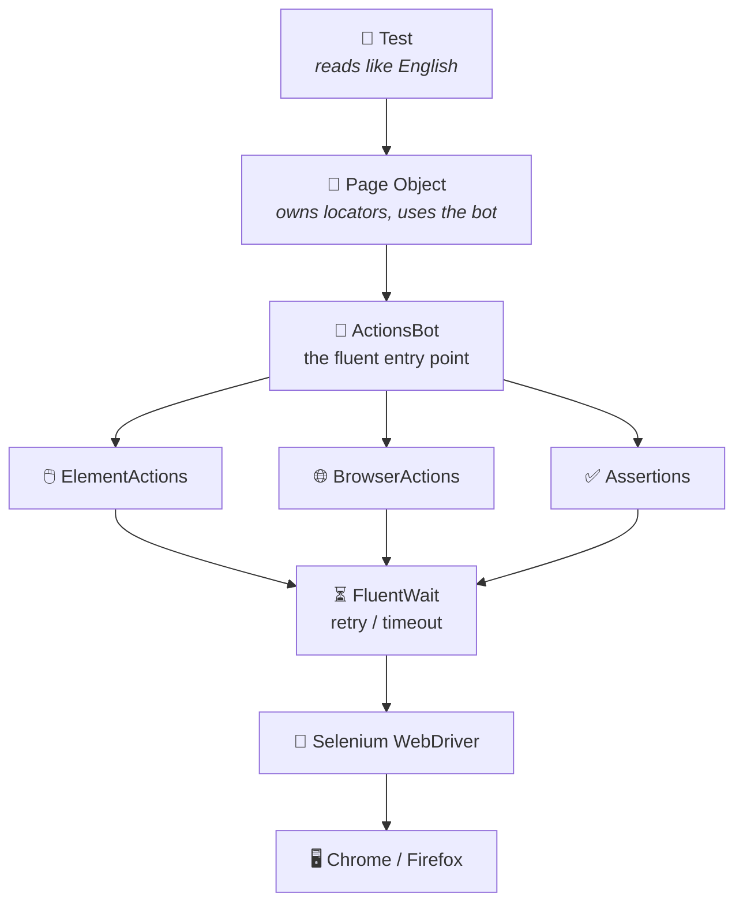
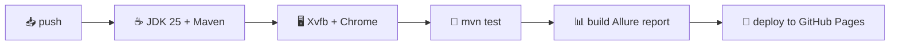

# 🤖 testAutomation

> A Selenium UI test-automation project: a fluent **`bot`** powers clean page objects, the **tests read like plain English**, and every run publishes a rich report — automatically, in the cloud.

[](https://github.com/MEltayar/testAutomation/actions/workflows/tests.yml)


### 📊 **[▶ View the live test report](https://meltayar.github.io/testAutomation/)**
Published automatically to GitHub Pages after every push.

---

## ✨ Highlights

| | | |
|---|---|---|
| 🧪 | **English-like tests** | Tests chain page methods and read like plain sentences — no Selenium in the test itself |
| 🔗 | **Fluent engine** | A chainable API (`bot.element()…`) that powers your **page objects** |
| 🧩 | **Grouped API** | `element()` · `browser()` · `assertThat()` — pick a category, get only its methods |
| ⏳ | **Self-healing waits** | Every action retries via `FluentWait` until it works or times out — fewer flaky runs |
| 🏭 | **Driver factory** | Switch Chrome ⇄ Firefox from **one line of config**, not code |
| ⚙️ | **External config** | Browser, timeout, and per-app URLs live in `config.properties` |
| 📄 | **Page Object Model** | Locators sealed inside pages; tests speak in business steps |
| 📝 | **Logging** | Clean SLF4J/Logback console output for every step |
| 📸 | **Screenshot on failure** | Captured **at the exact failing step** and attached to the report |
| 🔄 | **CI/CD** | GitHub Actions runs the suite on every push and publishes the report online |

---

## ✍️ How it reads — three layers

The fluent **`bot`** API is only ever used **inside page objects**. Your **tests never call `bot`** — they chain page methods, so a test reads as plain English.



| Layer | Package | Job | Talks to |
|---|---|---|---|
| 🧪 **Tests** | `tests.*` | *Which* scenarios to run | page objects only |
| 📄 **Pages** | `pages.*` | *What* a page can do (locators + flows) | the `bot` |
| 🤖 **Engine** | `engine.*` | *How* to drive the browser (app-agnostic) | Selenium |

---

## 🧪 A test reads like English

Tests chain **page methods** — no `bot`, no locators, no Selenium:

```java
@Test
public void successfulLoginTest() {
    new Login(bot)
        .navigateTo()
        .login("standard_user", "secret_sauce")
        .assertInventoryPageURL();
}
```

```java
@Test
public void secondResultLinkIsLinkedIn() {
    new DuckDuckGoHomePage(bot)
        .navigateTo()
        .searchForSeleniumCucumberIO()
        .assertSecondResultLinkContainsLinkedIn();
}
```

---

## 📄 …and the page uses the fluent `bot`

The `bot.` calls live **here**, inside the page — where the locators are:

```java
// pages/saucedemo/Login.java
public Inventory login(String user, String pass) {
    bot.element()
       .type(usernameInput, user)
       .type(passwordInput, pass)
       .click(loginButton);
    return new Inventory(bot);
}
```

---

## 🤖 The engine API (used inside pages)

One object — **`bot`** — hands out three specialists:

```java
bot.element()      // 🖱️ actions on elements
bot.browser()      // 🌐 actions on the browser
bot.assertThat()   // ✅ assertions (by target)
```

### 🖱️ Element actions
`type` · `click` · `submit` · `clear` · `doubleClick` · `hover` · `selectByText`

### 🌐 Browser actions
`navigateTo` · `refresh` · `back` · `forward` · `quitBrowser`

### ✅ Assertions — pick a target, then the check
```java
bot.assertThat().browser().titleIs("Google");
bot.assertThat().browser().urlContains("/inventory");
bot.assertThat().element(logo).isDisplayed();
bot.assertThat().element(cartBadge).textIs("1");
```
**Browser:** `urlIs` · `urlContains` · `titleIs` · `titleContains`
**Element:** `isDisplayed` · `isSelected` · `isEnabled` · `textIs` · `textContains` · `attributeIs` · `linkHrefIs` · `linkHrefContains`

---

## 📁 Project structure

```
src/main/java/
├── engine/                      🤖 the reusable engine
│   ├── ActionsBot.java          ⤷ fluent entry point (the bot)
│   ├── element/                 🖱️ type · click · submit · clear · hover · doubleClick · selectByText
│   ├── browser/                 🌐 navigateTo · refresh · back · forward · quitBrowser
│   ├── assertion/               ✅ dispatcher → element(locator) / browser()
│   ├── config/                  ⚙️ reads config.properties
│   ├── driver/                  🏭 builds Chrome / Firefox
│   └── report/                  📝 logging + Allure step + screenshot
└── pages/                       📄 page objects (app-specific, use the bot)
    ├── duckduckgo/ · saucedemo/ · heroku/

src/test/java/
├── tests/                       🧪 the actual @Test classes (English-like)
│   ├── duckduckgo/ · saucedemo/ · heroku/
├── templates/                   🧱 TestCase / TestScenario base classes
└── listeners/                   🎧 ReportServer (clean-before / serve-after)
```

---

## ⚙️ Configuration

Everything tunable lives in **`src/main/resources/config.properties`** — change it, no recompiling:

| Key | Example | Meaning |
|---|---|---|
| `browser` | `chrome` \| `firefox` | Which browser to launch |
| `timeout` | `5` | Seconds before an action gives up |
| `pollingMillis` | `250` | How often it re-checks while waiting |
| `autoServeReport` | `true` | Auto-open the report locally after a run (Windows) |
| `sauceDemoBaseURL` | `https://www.saucedemo.com` | Per-app base URL |

---

## ▶️ Running locally

```bash
# run the whole suite
mvn test

# run one test class
mvn test -Dtest=SauceDemoTests

# switch browser without touching code
#   → set  browser=firefox  in config.properties

# open the report in your browser
mvn allure:serve
```

---

## 📊 Reporting

Powered by **Allure**. Every action becomes a named step; on a failure, a **screenshot is captured at the exact failing step** and attached.

```
run starts → old results wiped
each action → logged + recorded as a step
on failure  → 📸 screenshot pinned to that step
run ends    → report published (locally or to GitHub Pages)
```

---

## 🔄 CI/CD — GitHub Actions

On every **push** (or manual trigger), `.github/workflows/tests.yml`:



Result: a fresh, **[live report](https://meltayar.github.io/testAutomation/)** after every push — no laptop required.

---

## 🛠️ Tech stack

**Java 25** · **Selenium 4** · **TestNG** · **Allure** · **SLF4J + Logback** · **Maven** · **GitHub Actions**

---

<sub>A learning project, built step by step — from a single class into a layered, reported, CI-backed test project. 🚀</sub>
